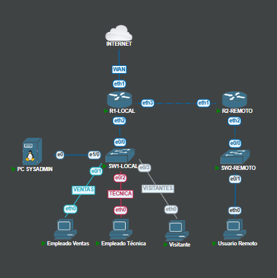

# Diagrama de RED

Este documento presenta el **diagrama lógico de la red** y el **plan de direccionamiento IPv4** realizado con **VLSM** sobre la red base `10.10.17.0/24`.  
El diagrama muestra la interconexión entre switches, routers y la PC SYSADMIN, mientras que la tabla resume las subredes asignadas a cada VLAN, incluyendo su rango de hosts, máscara, broadcast y direcciones gateway.  

---

## Subneteo y Direccionamiento IPv4 - VLSM para 10.10.17.0/24

| VLAN         | Red Subnet       | Máscara          | Rango Hosts Válidos       | Dirección Broadcast | Hosts Usables | IP Gateway (Router) |
|--------------|------------------|------------------|---------------------------|---------------------|--------------|--------------------|
| Ventas (280) | 10.10.17.0/27    | 255.255.255.224  | 10.10.17.1 – 10.10.17.30  | 10.10.17.31         | 30           | 10.10.17.1         |
| Técnica (281)| 10.10.17.32/28   | 255.255.255.240  | 10.10.17.33 – 10.10.17.46 | 10.10.17.47         | 14           | 10.10.17.33        | 
| Visitantes(282)| 10.10.17.48/29 | 255.255.255.248  | 10.10.17.49 – 10.10.17.54 | 10.10.17.55         | 6            | 10.10.17.49        | 
| Gestión (1799)| 10.10.17.56/29   | 255.255.255.248  | 10.10.17.57 – 10.10.17.62 | 10.10.17.63         | 6            | 10.10.17.57        | 
| Red remota   | 10.10.17.64/30   | 255.255.255.252  | 10.10.17.65 – 10.10.17.66 | 10.10.17.67         | 2            | 10.10.17.65(R1) - 66(R2)       | 
| Rango libre  | 10.10.17.68-255  | -                | -                         | -                   | -            | -                  | 
