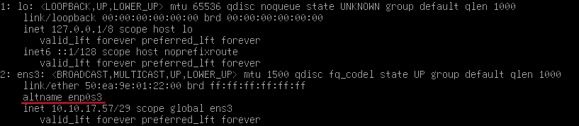

# Configuración de la PC SYSADMIN en Debian 12 

Este documento explica cómo establecer la configuración básica de la PC SYSADMIN para poder conectarse a los dispositivos de red mediante **SSH**.  
Incluye la asignación de dirección IP en la VLAN de gestión, la instalación de Python y Netmiko, y los pasos para ejecutar los scripts de automatización.

## 1. Verificar interfaz de red activa

Usá este comando para ver qué interfaz tenés disponible:

```bash
ip a
```

Ignorá la interfaz `lo`. La que identifiques será la que uses para configurar tu IP.


---

## 2. Asignar IP estática y ruta por defecto

Ejecutar los siguientes comandos (reemplazá `enp0s3` si tu interfaz tiene otro nombre):

```bash
sudo ip addr add 10.10.17.57/29 dev enp0s3
sudo ip link set enp0s3 up
sudo ip route add default via 10.10.17.59
```

- `10.10.17.57/29` → IP de tu PC SYSADMIN  
- `10.10.17.59` → IP del MikroTik que actúa como gateway

---

## 3. Verificar conectividad

Probar comunicación con la puerta de enlace, una IP pública y un dominio:

```bash
ping 10.10.17.59     # MikroTik
ping 8.8.8.8           # IP pública (Google)
ping google.com        # DNS
```

Si falla la resolución de nombres, configurar DNS:

```bash
sudo nano /etc/resolv.conf
```

Agregar:

```
nameserver 8.8.8.8
nameserver 1.1.1.1
```

---

## 4. Instalar Python y pip

Actualizar repositorios e instalar:

```bash
sudo apt update
sudo apt install python3 python3-pip
```

Verificar versiones:

```bash
python3 --version
pip3 --version
```

---

## 5. Instalar Netmiko

Instalar el módulo para conexiones SSH en red:

```bash
pip3 install netmiko
```

> Esto también instalará Paramiko para conexiones SSH.

---

## 6. Instalar wget (opcional)

Si no está instalado, hacerlo con:

```bash
sudo apt install wget
```

---

## 7. Descargar el script desde GitHub

Usar `wget` para obtener el archivo en formato RAW:

```bash
wget https://raw.githubusercontent.com/Gordopolis9/RED-WITH-NETMIKO/master/Scripts/ConfNETMIKO.py
```

**Cómo obtener el enlace RAW:**

1. Abrir el archivo en GitHub.  
2. Clic en "Raw".  
3. Copiar la URL del navegador.

---

## 8. Ejecutar el script

Ejecutar el archivo Python:

```bash
python3 ConfNETMIKOt.py
```
Luego en el menu seleccione la opción 1. Testear conexiones SSH 
> Esto verifica el acceso a los dispositivos por SSH.

---

## Extras útiles

Ver contenido del script:

```bash
cat ConfNETMIKO.py
```

Editar el script:

```bash
nano ConfNETMIKO.py
```
